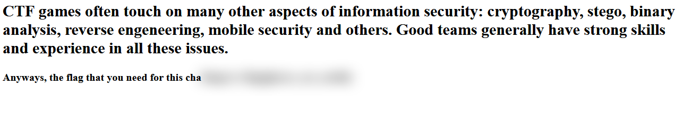

## Problem
```
I can't see :(

https://blurry-eyes.web.hsctf.com

Author: meow
```

## Solution
The problem links to a webpage that provides some CTF information, and the flag for the challenge. However, the flag is blurred:


Viewing the page source, we find that the blurred text is given the class of "blur":
```
<h4>Anyways, the flag that you need for this cha<span class="blur">llenge is: <span class="poefKuKjNPojzLDf"></span></span></h4>
```

Removing the class name using Firefox's inspector unblurs the flag.

**Flag:** ```flag{glasses_are_useful}```