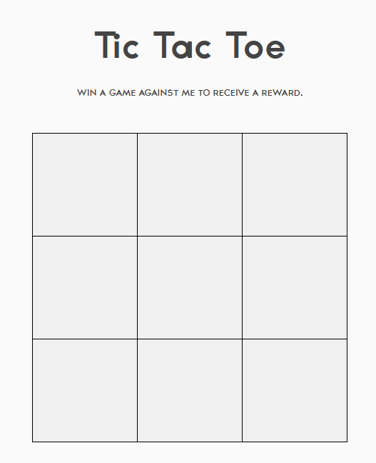

## Problem
```
Hello there, I invite you to one of the largest online global events in history ... the Tic Tac Toe World Championships!
http://challenge.rgbsec.xyz:8974/


~BobbaTea#6235, bAse#0001
```

## Solution
The link brings us to a Tic Tac Toe board:



The goal appears to be to win against the bot in order to obtain the flag. However, since Tic Tac Toe is a game where no player can win assuming perfect play from both sides, it's unlikely that the solution would be to attempt to win, unless the computer opponent had flawed strategy.

After playing a few rounds against the computer, I noticed an interesting quirk: the bot would prioritize blocking my potential win, instead of taking a win for themselves. This could be exploited to get a winning strategy!


Winning the game gives us the base64 encoded string ```cmdiQ1RGe2g0aDRfajR2NDJjcjFwN19ldjNuNzJfQVIzX2MwMEx9```, which we can decode to get the flag.

I also took a look at the code (obfuscated javascript), and you can immediately spot something that seems out of place in the variable array at the very top of the code:

```js
var _0x4055 = ['_0x45bed8', '_0x46598b', '_0x44a4cb', 'KIOWz', 'index', '_0x282056', '_0x16414f', 'PWjXB', '_0x32aa90', '_0x5d9324', '_0x2b447c', '_0x4b6df6', 'IzpZV', '_0x43b394', '_0x846557', '_0x4ccd04', '_0x156e50', '_0x37ab44', '_0x3df745', '_0xfa296', '_0x3bd5b8', '_0x42b5c7', '_0x2e914c', '_0x5acb06', '_0xf567ee', '_0x2c09ce', 'yHVMg', 'JfuFq', '_0x501e94', '_0x332059', 'from', 'keys', '_0x32d7fd', '_0x5cceef', '_0x1713cd', '_0x4870d6', '_0x433f53', '_0x35864d', 'atBzL', '_0x929cc0', '_0x1ed9f1', '_0x261ab9', '_0x32e9c3', 'HPtfK', '_0x358bd2', '_0x5a90cd', '_0x59b8c2', 'cmdiQ1RGe2g0aDRfajR2NDJjcjFwN19ldjNuNzJfQVIzX2MwMEx9', '_0x45df6f', '_0x3677a5', etc]
```

The base64 string stands out, and is the same string you get from beating the game.

Neither of these ended up being the intended solution (but definitely the way everyone got the flag)! The challenge author stated this after the event on Discord:

```
the actual solution, which im sure noone got because of the flag leak, was to intercept the "move" event and override the handler
```

**Flag:** ```rgbCTF{h4h4_j4v42cr1p7_ev3n72_AR3_c00L}```