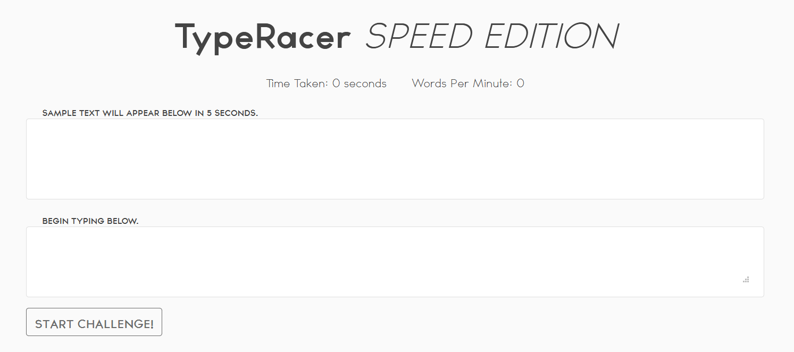

## Problem
```
I AM SPEED! Beat me at TypeRacer and the flag is all yours!
http://challenge.rgbsec.xyz:8973/


~BobbaTea#6235, bAse#0001
```

## Solution
The link brings us to a webpage that appears to be a version of TypeRacer (a typing speed test):



Upon clicking the "Start Challenge!" button, sample text appears in the above box, and the user needs to type the text that appears. I tried it manually, and got around 100 WPM which wasn't enough. We'll need to look into scripting it.

Looking at the HTML of the sample text, we find that the order is different than the order in pure HTML, instead being ordered by a css property:

```html
<div class="card-body" style="min-height: 120px; display: flex;flex-wrap: wrap" id="Ym9iYmF0ZWEh">
<span style="order: 36; height:min-content">roof&nbsp;</span>
<span style="order: 37; height:min-content">nearest&nbsp;</span>
<span style="order: 44; height:min-content">seems&nbsp;</span>
<span style="order: 15; height:min-content">salt&nbsp;</span>
...
</div>
```

We can start by writing a script to extract the text in correct order:

```js
let words = new Array(50);
for (let i = 0; i < 50; i++){
    const span = document.getElementsByClassName('card-body')[0].getElementsByTagName('span')[i];
    words[span.style.order] = span.innerHTML.replace('&nbsp;', ' ');
}
let typedWords = "";
for (let j = 0; j < words.length; j++) {
    typedWords += words[j];
}

console.log(typedWords);
```

To do this, we iterate through each span element inside the ```card-body``` class of the div that contains the words. For each span element, we grab the order style and use that as the array index of the word inside the span. After that, we rebuild to the expected string from our newly built array, and get an output like how the text appears to the user:

```
here throughout corn exact worry forest case together exercise team caught rope airplane cutting lot salt go blue summer somewhere wagon class pair elephant him hill fallen foot alphabet stems even continued edge pencil least long roof nearest suppose shoe weak ring dinner service seems quickly flow recently pay owner 
```

Now we need to give the website the string of words. Originally, I tried to set the value of the input textarea, but the website uses events to add characters, so that didn't work. I struggled for a while trying to get a working keyboard event triggered, until my teammate suggested using AutoHotkey. It's trivial to write a quick script that will type given input:

```ahk
LCtrl::
Send, here throughout corn exact worry forest case together exercise team caught rope airplane cutting lot salt go blue summer somewhere wagon class pair elephant him hill fallen foot alphabet stems even continued edge pencil least long roof nearest suppose shoe weak ring dinner service seems quickly flow recently pay owner  
```

When the script is running and left control is pressed, AutoHotkey will simulate a user typing all of the given text. To ensure we have enough time to obtain the string and to update/run the script, we can use our browser's debugger feature to pause the Javascript.

Running this script worked like a charm, and we got our flag in base64 format:

```
Congrats you have beaten me! Here's your flag: cmdiQ1RGe3c0MHdfajR2NDJjcjFwN18xMl80bm4weTFuZ30=
```


**Flag:** ```rgbCTF{w40w_j4v42cr1p7_12_4nn0y1ng}```